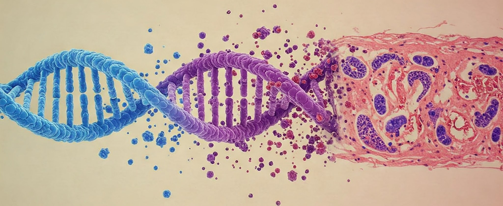

# From Genes to Tissue Morphology ##
This is the official codebase accompanying the paper *Connecting Gene Expression and Tissue Morphology with Conditional Generative Models*.
We leverage generative models to infer tissue morphology from gene expression in spatial transcriptomics data.
By adapting the CLIP framework to gene expression and histology image data, a morphology-aligned representation of the gene expression is learned.
This representation is subsequently incorporated in the StyleGAN-T and Stable Diffusion architecture to generate histological image patches conditioned on gene expression.
The generated morphologies accurately reflect hallmarks of the respective regions that the gene expression was captured in.

## 🏗️ Setup ##
To create your environment and install the necessary dependencies, use the following commands
  ```
  conda create --name g2i python=3.9
  conda activate g2i
  python -m pip install pip==23.0
  conda install pytorch=1.9.1 torchvision==0.10.1 pytorch-cuda=11.6 -c pytorch -c nvidia
  pip install -r requirements.txt
  ```


## 🧬 Data Preparation ##

We work with 10X Visium and 10X Visium HD samples that have already been processed with [Space Ranger](https://www.10xgenomics.com/support/software/space-ranger/latest).

**10X Genomics:** 
- [Training sample](https://www.10xgenomics.com/datasets/visium-hd-cytassist-gene-expression-libraries-of-mouse-kidney): Visium HD processed FFPE coronal section of baby mouse kidney
- [Sample 1](https://www.10xgenomics.com/datasets/adult-mouse-kidney-ffpe-1-standard-1-3-0): Standard Visium processed FFPE coronal section of adult mouse kidney

**F. Hoffmann-La Roche:**
- [Sample 2-5](): Standard Visium processed FFPE transverse section of baby mouse kidney

### Preprocessing of Spatial Transcriptomics Data

Before starting the training, the following preprocessing steps have to be completed: 
1. Extract Patches corresponding to (pseudo) capture spots from the WSI
2. [Only Visium HD] Aggregate gene expression of 27x27 2um bins into pseudo-spots
3. Stain normalize and dump the image patches to a folder
4. Filter and sort the genes according to ```vocab.txt```

Code for each step can be found in [`preprocessing/`](preprocessing).
To run all steps in a pipelined fashion, use ```preprocessing/preprocessing.sh```.

### Image-Gene datasets

The training pipeline can take as input preprocessed image patches that are stored in an image folder.
The gene expression is stored in preprocessed form as a ```.h5ad``` file.
Please adhere to the guidelines in the section above for preprocessing your own Spatial Transcriptomics datasets.
Note that we assume that a dataset only contains data from a single tissue sample. If you wish to combine multiple samples into the same dataset,
the gene expression normalization that is currently handled by ```ImageGeneDataset``` has to be performed per sample.


## 🧠 Models ##
### CLIP ###
The UNI foundational model is used as a frozen feature extractor in the image branch. Due to dependency conflicts, you have to download the weights from the HuggingFace hub in an environment with a higher version of `timm` once.
```
conda create --name uni python=3.11
conda activate uni 
conda install pytorch=2.5.1 torchvision==0.20.1 pytorch-cuda=12.1 -c pytorch -c nvidia
pip install timm==1.0.11
```
Make sure that you are logged in to the HuggingFace hub and requested access to the UNI weights before running the following commands.
```python
>>> from networks.histo_models import dump_model_to_disk
>>> local_path = "./models/uni.pt"
>>> dump_model_to_disk("uni", out_location = local_path)
```
Then set `histo_models.UNI_STATE_DICT_PATH` to the location of your weights.

#### Training

Run the following command to train the CLIP model on preprocessed data:
```
python train_clip.py ++data.train_gex <GEX FILE>.h5ad ++data.train_image_dir <IMAGE FOLDER> ++data.val_gex <VAL GEX FILE>.h5ad ++data.val_image_dir <VAL IMAGE FOLDER>
```
The training script uses PyTorch Lightning and Hydra, so hyperparameters can be adjusted by changing `assets/clip_config.yaml` or alternatively by overriding them directly on the CLI.
Model checkpoints logged during training have to be converted into dict form using `CLIP.convert_ckpt_to_dict(<CHECKPOINT FILE>, <CONFIG FILE>, "mymodel.pt")`.

#### Representation Inference

To obtain gene expression and image embeddings for a sample, inference can be performed with a pretrained CLIP model using the following command
```
python clip_embeddings.py --network <DICT-STYLE CLIP WEIGHTS> --gex <GEX FILE>.h5ad --images <IMAGE DIR> --out-dir <RESULT DIR>
```

### StyleGAN-G ###
#### Training

```
python -m torch.distributed.run --standalone --nproc_per_node <N GPUS> train_gan.py --data <IMAGE FOLDER> --gex <GEX FILE>.h5ad --val_data <VAL IMAGE FOLDER> --val_gex <VAL GEX FILE>.h5ad --img-resolution 64 --outdir ./runs --batch 128 --cfg lite --clip-weight 0.2 --kimg 128000 --snap 10 
```
To see additional hyperparameters run `python train_gan.py --help`

#### Generating Morphologies

To generate images based on specific gene expression prompts, run
```
python gen_images.py --network_pkl <PATH TO WEIGHTS> --gex <PROMPTS>.npy --n-samples 4 --outdir ./samples --seeds 0 --truncation 1
```
You can either provide a `.h5ad` file containing gene expression from all pseudo-spots and sample `n-samples` prompts from each unique cluster-in this case, provide the cluster labels as a numpy file with `--clusters`. Alternatively, you can directly provide a numpy file containing a smaller number of gene expression prompts and generate images for each of them.
If you want to provide the prompts as a numpy file of CLIP gene expression embeddings instead of raw gene expression, set the flag `--encoded`. 
To see additional hyperparameters, run `python gen_images.py --help`.


### Stable Diffusion ###
The Stable Diffusion pipeline does not use Image-Gene datasets, but directly operates on precomputed prompt embeddings and an image folder.
You can use any gene expression prompt embedding of choice for conditioning.

For detailed instructions, please refer to [diffusion_utils/README.md](diffusion_utils/README.md).

## 📊 Evaluation ##

### Image Quality Metrics

We compute Frechet Inception Distance and Kernel Inception Distance for all our models.
As reference data, we use random patches from the training sample to mitigate distributional shift between images captured with different scanners.
To extract a dataset of random patches from a whole slide image, the tissue must first be segmented using the [HEST library](https://github.com/mahmoodlab/HEST/) and the boundaries are stored in a geopandas object.
Afterwards, run the following command
```
python preprocessing/extract_patches.py --wsi-file <WSI> --tissue-seg-file <TISSUE BOUNDARY>.geojson --out-file ./data/random_patches.h5 --n-pts <NUMBER PATCHES>
```
and store the extracted patches in a directory using
```python
>>> from preprocessing.dump_patches import dump_patches_to_folder_single
>>> dump_patches_to_folder(images_path = "./data/random_patches.h5", wsi_path = <WSI>, out_dir = "./data/random_patches/")
```
The metric computation is performed on image folders, allowing for easy adaptation to arbitrary models.
```
python calculate_image_quality_metrics.py --experiment <EXPERIMENT NAME> --ref-img-path <REAL DATA FOLDER> --gen-img-path <GENERATED DATA FOLDER>
```

### CLIP Embedding Space

#### Geometric Structure

To assess batch effect integration and information retention in the CLIP embedding space, follow the steps outlined in [`analysis_notebooks/clip_latent_space_analysis.ipynb`](analysis_notebooks/clip_latent_space_analysis.ipynb).

#### Biological Interpretability

Differences in the CLIP embedding space between average gene expression profiles of clusters can be attributed to input genes.
Run the following commmand to obtain attribution scores for each gene in each pair of clusters:
```
python interpretability.py --network <CLIP WEIGHTS> --gex <GEX DATA>.h5ad --cluster-labs <LABELS>.npy --out-file "./gene_scores.csv"
```
and then follow the steps outlined in [`analysis_notebooks/attribution_analysis.ipynb`](analysis_notebooks/attribution_analysis.ipynb).

### scGPT Embedding Space

For a tutorial on how to embed Spatial Transcriptomics samples with [scGPT](https://github.com/bowang-lab/scGPT) and analyze the resulting latent space, consult [`analysis_notebooks/scGPT_embeddings.ipynb`](analysis_notebooks/scGPT_embeddings.ipynb).

## Acknowledgements ##
All files that are partially or fully based on third party Github repositories include the original license and link to the source at the beginning. 
The copyright to these files is held by their original authors.

This repository builds heavily on the [StyleGAN-T](https://github.com/autonomousvision/stylegan-t) and [MorphoDiff](https://github.com/bowang-lab/MorphoDiff) codebases. 
If you find our work helpful, please also consider citing
```bibtex
@InProceedings{Sauer2023ARXIV,
  author    = {Axel Sauer and Tero Karras and Samuli Laine and Andreas Geiger and Timo Aila},
  title     = {{StyleGAN-T}: Unlocking the Power of {GANs} for Fast Large-Scale Text-to-Image Synthesis},
  journal   = {{arXiv.org}},
  volume    = {abs/2301.09515},
  year      = {2023},
  url       = {https://arxiv.org/abs/2301.09515},
}
@InProceedings{Navidi2025morphodiff,
    author={Zeinab Navidi and Jun Ma and Esteban Miglietta and Le Liu and Anne E Carpenter and Beth A Cimini and Benjamin Haibe-Kains and Bo Wang},
    title={{MorphoDiff}: Cellular Morphology Painting with Diffusion Models},
    booktitle={The Thirteenth International Conference on Learning Representations},
    year={2025},
    url={https://openreview.net/forum?id=PstM8YfhvI}
}
```

## Citation ##
```bibtex
@InProceedings{Lohmann2025genes2morphology,
  author    = {Frederieke Lohmann and Alberto Valdeolivas and Jelica Vasiljevic},
  title     = {Connecting Gene Expression and Tissue Morphology with Conditional Generative Models},
  journal   = {Proceedings of the Workshop on Generative AI for Biology at the Forty-second International Conference on Machine Learning},
  year      = {2025}
}
```
